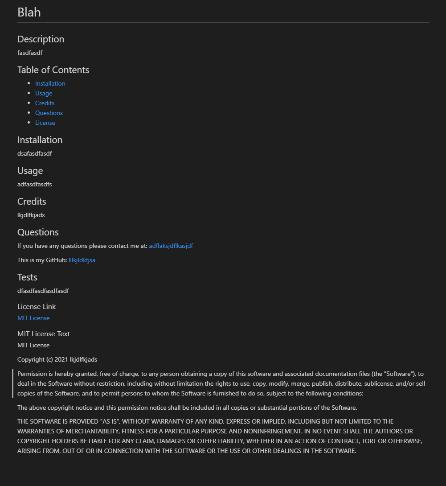

# README Gen

Creates a README file for you project, that includes only the information you want to include.

## Installation

To run this code you will need Node.js, Inquirer. 
NPM is used to install inquirer.
Node runs the file Index to create the README.

## Usage

Run this code to create a README for projects without having to check how to write a README again.
To run the code you will do 'node index.js' or 'node index' in the terminal while in the root directory of this program.

## Credits

Victor L Perez

## Questions

If you have any questions please contact me at: [Zunaty@gmail.com](Zunaty@gmail.com) 

This is my GitHub: [Zunaty](https://github.com/Zunaty) 

### License Link

[MIT License](https://choosealicense.com/licenses/mit/)

### MIT License Text

MIT License

Copyright (c) 2021 Victor L Perez

Permission is hereby granted, free of charge, to any person obtaining a copy
of this software and associated documentation files (the "Software"), to deal
in the Software without restriction, including without limitation the rights
to use, copy, modify, merge, publish, distribute, sublicense, and/or sell
copies of the Software, and to permit persons to whom the Software is
furnished to do so, subject to the following conditions:

The above copyright notice and this permission notice shall be included in all
copies or substantial portions of the Software.

THE SOFTWARE IS PROVIDED "AS IS", WITHOUT WARRANTY OF ANY KIND, EXPRESS OR
IMPLIED, INCLUDING BUT NOT LIMITED TO THE WARRANTIES OF MERCHANTABILITY,
FITNESS FOR A PARTICULAR PURPOSE AND NONINFRINGEMENT. IN NO EVENT SHALL THE
AUTHORS OR COPYRIGHT HOLDERS BE LIABLE FOR ANY CLAIM, DAMAGES OR OTHER
LIABILITY, WHETHER IN AN ACTION OF CONTRACT, TORT OR OTHERWISE, ARISING FROM,
OUT OF OR IN CONNECTION WITH THE SOFTWARE OR THE USE OR OTHER DEALINGS IN THE
SOFTWARE.

### Preview and Video Link

[Video Walkthrough](https://drive.google.com/file/d/17YtpswmFKCH4T1Z3aNzN9HsGpdp8ft7s/view)

